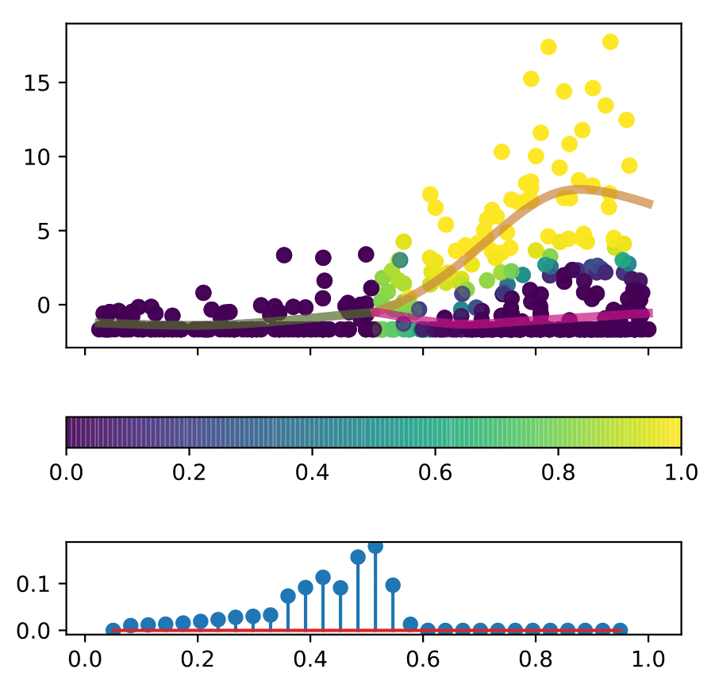
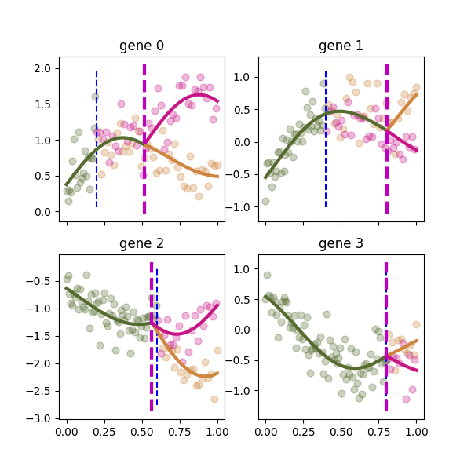

# BranchedGP

BranchedGP is a package for building Branching Gaussian process models in python, 
using [TensorFlow](github.com/tensorflow) and [GPFlow](https://github.com/GPflow/GPflow).
You can install it via `pip install BranchedGP`.

The package contains two main models:
* `BranchedGP.assigngp_dense.AssignGP` is an implementation of the BGP model described in
  ["BGP: Branched Gaussian processes for identifying gene-specific branching dynamics in single cell data",
  Alexis Boukouvalas, James Hensman, Magnus Rattray, bioRxiv, 2017.](http://www.biorxiv.org/content/early/2017/08/01/166868).
  - This is now published in [Genome Biology](https://genomebiology.biomedcentral.com/articles/10.1186/s13059-018-1440-2).
* `BranchedGP.MBGP.assigngp.AssignGP` is an implementation of the MBGP model described in
  ["Modelling sequential branching dynamics with a multivariate branching Gaussian process", Elvijs Sarkans, Sumon Ahmed, Magnus Rattray, Alexis Boukouvalas, OpenReview, 2022](https://openreview.net/forum?id=9KoBOlstTq)
  - This is now accepted in [Transactions on Machine Learning Research](https://openreview.net/group?id=TMLR)
  
[](https://github.com/ManchesterBioinference/BranchedGP/workflows/CI)

## BGP 

### Example
An example of what the model can provide is shown below.
   1. The posterior cell assignment is shown in top subpanel: each cell is assigned a probability of belonging to a  branch.
   1. In the bottom subpanel the posterior branching time is shown: the probability of branching at a particular pseudotime.



### Quick start
For a quick introduction see the `notebooks/Hematopoiesis.ipynb` notebook.
Therein we demonstrate how to fit the model and compute
the log Bayes factor for two genes.

The Bayes factor in particular is calculated by calling `CalculateBranchingEvidence`
after fitting the model using `FitModel`.

This notebook should take a total of 6 minutes to run.

| File <br> name | Description |
| --- | --- |
| Hematopoiesis       | Application of BGP to hematopoiesis data. |
| SyntheticData       | Application of BGP to synthetic data. |
| SamplingFromTheModel| Sampling from the BGP model. |


### Comparison to monocle-BEAM

In the paper we compare the BGP model to the BEAM method proposed
in monocle 2. In ```monocle/runMonocle.R``` the R script for performing
Monocle and BEAM on the hematopoiesis data is included.

### List of python library files
| File <br> name | Description |
| --- | --- |
| FitBranchingModel.py | Main file for user to call BGP fit, see function FitModel |
| pZ_construction_singleBP.py | Construct prior on assignments; use by variational code. |
| assigngp_dense.py | Variational inference code to infer function labels. |
| assigngp_denseSparse.py | Sparse inducing point variational inference code to infer function labels. |
| branch_kernParamGPflow.py | Branching kernels. Includes independent kernel as used in the overlapping mixture of GPs and a hardcoded branch kernel for testing. |
| BranchingTree.py | Code to generate branching tree. |
| VBHelperFunctions.py | Plotting code. |


## MBGP

MBGP is an extension of the BGP model, which addresses the shortcoming of
BGP assigning observations to latent functions independently for each output dimension (gene). 
This leads to inconsistent assignments across outputs
and reduces the accuracy of branching time inference.
MBGP instead performs joint branch assignment inference across all output dimensions.
This ensures that branch assignments are consistent and
leverages more data for branching time inference.

### Example
See below for an example model fit to synthetic noisy data representing 4 genes.



### Quick start
For a quick introduction see the `notebooks/MBGP/synthetic_noise_free.ipynb` and
`notebooks/MBGP/experiments-figure-1-simple-fits.ipynb` notebooks.
Therein we demonstrate how to fit the model and visualise its fit.

A full list of key notebooks follows (ordered roughly according to how useful we expect them to be; 
higher is more useful).

| File name | Description |
| --- | --- |
| synthetic_noise_free                              | Application of MBGP to synthetic noise-free data. |
| experiments-figure-1-simple-fits                  | Application of MBGP to sythetic noisy data. |
| rediscover_early_branching                        | Exploration of fitting MBGP and BGP to synthetic noisy data. Performs sanity checks, compares priors and computes inconsistent assignments by BGP. Takes a while to run. |
| rediscover_early_branching2                       | Exploration of fitting MBGP and BGP to synthetic noisy data. Compares various priors and computes inconsistent assignments by BGP. Takes a while to run. |
| experiments-figure-2-correct-cell-histogram       | Evaluation of MBGP vs BGP label assignment to synthetic noisy data (no branching point learning). Strong prior. Takes a long time to run. |
| experiments-figure-3-bgp-label-inconsistency      | Evaluation of MBGP vs BGP fits to synthetic noisy data (branching points are learned). Strong prior. Takes a long time to run. |
| new_experiments-figure-2-correct-cell-histogram   | An alternative re-derivation of the `experiments-figure-2-correct-cell-histogram.ipynb` notebook. |
| new_experiments-figure-3-bgp-label-inconsistency  | An alternative re-derivation of the `experiments-figure-3-bgp-label-inconsistency.ipynb` notebook. |
| synthetic_Y_without_crossing                      | Explores the generation of synthetic noisy data that avoids latent branches crossing after the initial branching point. |

# Development setup

Create a virtual environment, activate it and run `make install`.

## Common tasks

* Tests: `make test`
* Install dependencies (into an active virtual environment): `make install`
  - If you're running on Apple silicon, you may want to take a look at the
    `setup_tensorflow_on_apple_silicon.sh` script.
* Format code: `make format`
* Run a jupyter notebook server: `make jupyter_server`

# Contributing

We welcome any and all contributions to the BranchedGP repo.
Feel free to create issues or PRs into the repo and someone will
take a look and review.

## Notebooks

We use [Jupytext](https://github.com/mwouts/jupytext) to help version
Jupyter notebooks.
Each notebook corresponds to a Python script, which is easy to review.
See also the Jupytext documentation on
[paired notebooks](https://jupytext.readthedocs.io/en/latest/#paired-notebooks).

Note that Jupytext should be automatically installed in
your virtual environment if you follow the instructions above.

### Updating an existing notebook

We want our notebooks to always work.
Therefore, before committing any changes to a notebook,
we ask contributors to re-run the notebook from scratch.

The Jupytext extension should automatically sync the notebook
to the paired script.
If you're unsure, you can always check
via `make check_notebooks_synced`
and manually run `make sync_notebooks` if needed.

### Adding a new notebook

Follow your usual procedure, but run `make pair_notebooks` afterwards.
This will produce the paired script
(or notebook if you're starting from a script).
Commit both the notebook as well as the paired notebook.

### Syncing notebooks

If Jupyter shows you a warning about the notebook being
out of sync with the master script, run `make sync_notebooks`.

## Formatting code

We automatically check that all contributions are formatted
according to the recommendations by
[black](https://black.readthedocs.io/en/stable/) and
[isort](https://pycqa.github.io/isort/).
If your changes fail these checks, all you need to do is run
`make format` and commit the changes.

## Static checks

We automatically check our code conforms to the coding standards
enforced by [flake8](https://flake8.pycqa.org/en/latest/manpage.html) and 
[MyPy](http://mypy-lang.org/).
You can check if your changes conform with these checks via `make static_checks`.